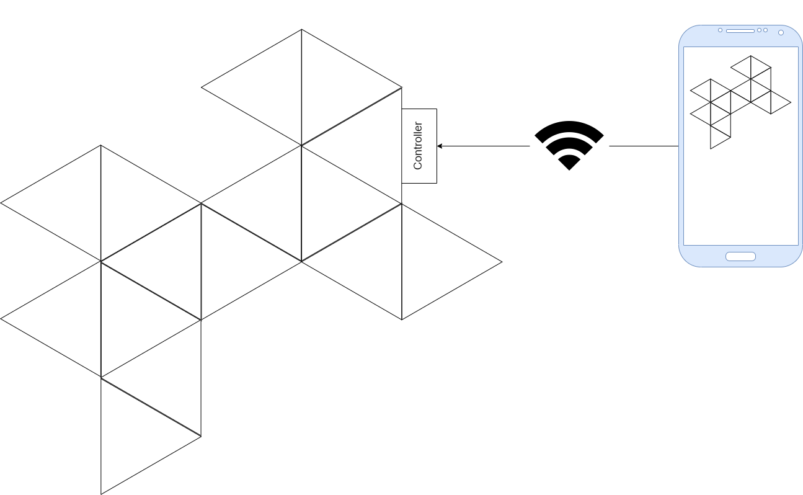
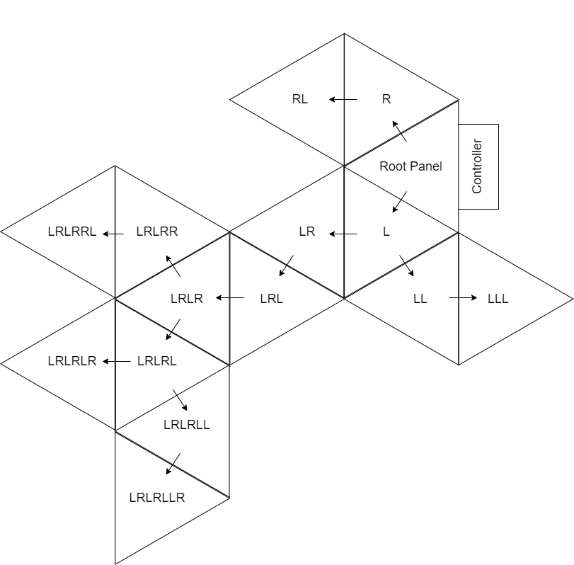

# Nanoleaf DIY

A recreation of [Nanoleaf light panels](https://nanoleaf.me/en/consumer-led-lighting/products/smarter-series/nanoleaf-light-panels-smarter-kit/), built for Arduino

## Controller

The controller is built to run on a NodeMcu ESP8266; it connects to one panel (the root) and exposes a REST API that allows users to send commands through it to any panel in the tree

### API Routes

`GET /network`

`GET /network/refresh`

`POST /panels/state`

`POST /panels/mode`

`POST /panels/color`

`POST /panels/customgradient`

## Node

Each panel is powered by an Arduino Nano; it accepts serial commands from three ports on the sides of the triangle to change the colors and patterns of its LEDs

The serial commands accepted by the panel are always a single-digit command number, followed by that command's arguments, terminated by a line return

### Command List

0. Forwarding command  
    `0<directions>|<target command>`  
    - Used to send any other command to a target panel in the tree using its "directions", i.e. the chain of left and right turns needed to reach it from the controller
    - When any panel receives this command, it pops the first character off the string of directions and sends the command in that direction ('L' or 'R')
    - Example of directions to different panels in an arrangement:
    
    - In this arrangement, to change the color of the bottommost panel to red, the controller would send `0LRLRLLR|5#FF0000` to the root panel
1. Broadcast command
    `1<target command>`
    - Similar to forwarding, but with no target; sends the command to both neighbors, replicating it to every panel in the network recursively
    - Useful for applying a shared color palette or lighting mode to the whole network simultaneously
2. Network Discovery  
    `2`
    - Used to recursively discover all panels connected to the tree
    - When a panel receives this command, it sends the same command to its left and right neighbors, concatenates their responses, wraps the whole thing in parentheses, and returns that to its parent
    - If the panel has no neighbors (is a leaf on the tree), it reples `(XX)` to represent that it has nothing to its left or right
    - This results in an encoding of the tree structure that can be deciphered by the controller to figure out the direction string needed to reach each panel
    - For our ongoing example, the encoded structure is as follows: `((((XX)X)((((XX)(((X(XX))(XX))((XX)X)))(XX))))((XX)X))`. (I think, it's hard to do by hand, I'll test it properly when I assemble that many panels)
3. Fetch current state
    `3`
    - This command allows the controller to fetch the current lighting state of a given panel; the panel will reply with its active mode (single digit number) appended with any parameters for that mode
    - e.x. If the panel was in solid color mode and was pure red, the state reply would be `0FF0000` (mode 0 + hex color code for red)
4. Set Mode  
    `4<mode>`
    - Used to change the panel's lighting mode to one of the built-in presets (0 for solid color, 1 for custom gradient, 3 for rainbow, etc.. - see node documentation for full list)
    - For modes that require parameters (e.g. color), the panel saves the last state of each mode in EEPROM so it can pick up where it left off
5. Set brightness  
    `5<brightness>`
6. Set Color Palette  
    `6<randomize><synchronize><length><r><g><b><transition>[<r><g><b><transition>][<r><g><b><transition>]...`
    - Used to set the color palette used in several lighting modes
    - Takes in the colors as a list of RGB values and delay times, as seen above
    - Persists the given palette in EEPROM
    - Parameters:
      - `randomize`: `0` or `1`
        - On `0` (default behavior), modes that use the color palette will iterate through it in sequence
        - On `1`, modes that use the color palette will iterate through it at random (without choosing the same color twice in a row)
      - `synchronize`: `0` or `1`
        - On `0`, each color in the palette will use a random transition time delay selected from all the ones in the palette; this is useful if you want to use one palette on an entire collection of panels, so the panels won't all start at the same time and remain in perfect sync
        - On `1` (default behavior), colors will use their own associated transition time delay
      - `length`: Single digit 0-9
        - The number of colors in the palette
      - Colors: An undelimited list of length `<length>` of the following parameters
        - `r`, `g`, and `b`: The RGB values of this color, written in two-digit zero-padded hexadecimal integer (`00`-`FF`)
        - `transition`: The number of milliseconds this color should last on the panel before transitioning to the next color, as a four-digit zero-padded integer (`0000`-`9999`)
<!-- 5. Set Refresh Rate  
    `5<refresh rate>`
    - Sets how often the LEDs are updated; has an impact on the speed of certain patterns, but needs reworking, pattern speed should be its own parameter and refresh rate should be a constant value -->
